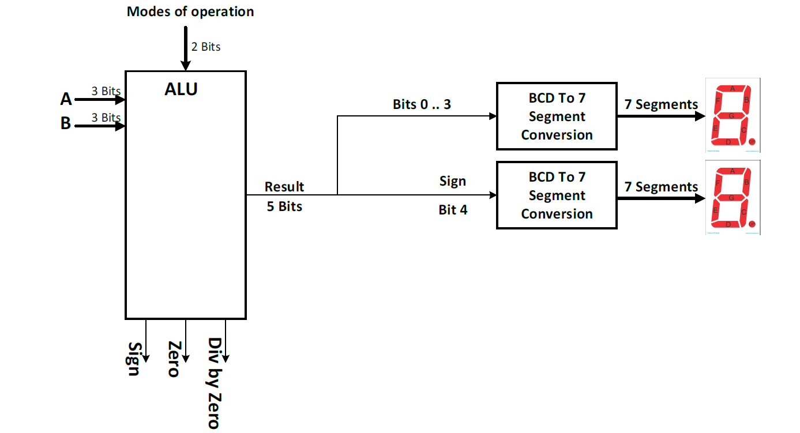

# Arithmetic-Logic-Unit
- This project was done during Fall 2021 semester as a project of Logic Design course (CMP1010).
## Introduction :
- ALU is capable of adding, subtracting, multiplying and calculating the remainder of two signed numbers and displays the result of the operation performed along
with some additional flags regarding the operation and the result on seven segments.

**Note:** All the files in ALU folder was made using *Logisim* program so you need to download it to be able to open this files.
## Block Diagram :

- ALU takes two 3-bits signed inputs A and B and an additional input called mode of operation which is 2-bits to inform the ALU which function to perform on A and B. It outputs 5-bits and 3 flags. the first four bits of the output represents the output number which would be decoded and displayed on seven segments and the 5th bit represents the sign of the output which would be displayed on another separate seven segments.

#### Flags :
- ALU outputs 3 flags which are :
1. Sign Flag :
     - The sign flag indicates if the result is negative. The flag is set to 1 if the result is negative and 0 otherwise.
2. Zero Flag:
     - The zero flag indicates if the result is zero. The flag is set to 1 if the result is zero and 0
otherwise.
3. Divide by Zero Flag :
      - The divide by zero flag indicates if we divide by zero. The flag is set to 1 if B operand equal
zero in division operation and 0 otherwise.
## Operations:
### 1. Adding and Subtracting :
- Adding or Subracting A and B where each of them is 3-bits and the mode of operation is determined using the selector bit where 0 represents addition and 1 represents subtraction.

### 2. Multiplication :

### 3. Remainder :

## Full Circuit :

